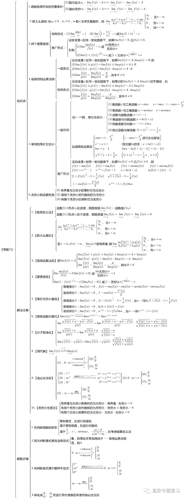

# 极限

<mark>考试内容：</mark>

```md
- 数列极限与函数极限的定义及其性质
- 函数的左极限与右极限
- 无穷小量和无穷大量的概念及其关系
- 无穷小量的性质及无穷小量的比较
- 极限的四则运算
- 极限存在的两个准则：单调有界准则和夹逼准则
- 两个重要极限：$\lim\limits_{x \to 0} \frac{\sin x}{x}=1$ 和 $\lim\limits_{x \to \infty}(1+ \frac{1}{x})^x=e$
```

<mark>考试要求：</mark>

```md
- 理解极限的概念，理解函数左极限与右极限的概念以及函数极限存在与左极限、右极限之间的关系．
- 掌握极限的性质及四则运算法则．
- 掌握极限存在的两个准则，并会利用它们求极限，掌握利用两个重要极限求极限的方法．
- 理解无穷小量、无穷大量的概念，掌握无穷小量的比较方法，会用等价无穷小量求极限．
```

## 数列的极限

总是可以从数列 $\{x_n\}$ 的某项开始（$\exists N,\;n>N$），使得 $\mid x_n -a \mid \;< \epsilon$（任意小），那么常数 $a$ 就是数列的极限

换种说法：若数列 $\{x_n\}$ 与常数 $a$ **无限接近**，那么 $a$ 就是数列的极限，即数列收敛于 $a$

### 数列极限的性质

- __唯一性__：如果数列收敛，那么它的极限是唯一的
- __有界性__：如果数列收敛，那么它有界（收敛必有界，有界不一定收敛）
- __保号性__：如果数列收敛，那么总是可以从某项起，它与它的极限同号
  - 反推：如果收敛数列从某项起，符号不再改变，那么它的极限的正负就与这个符号相同
- 如果数列收敛于 $a$，那么它的任意子列也收敛于 $a$  
  - 推论：如果数列的某两个子列收敛于不同的极限，那么该数列发散

### 数列的夹逼准则

> 如果数列 $\{x_n\}, \{y_n\}, \{z_n\}$ 满足下列条件:
>
> 1. 从某项起，即 $\exists\; n_0 \in N^+$，当 $n > n_0$ 时，有 $y_n \leqslant x_n \leqslant z_n$
> 2. $\Large\lim\limits_{n \to \infty}y_n = \lim\limits_{n \to \infty}z_n = a$
>
> 那么数列 ${x_n}$ 的极限存在, 且 $\lim\limits_{n \to \infty}x_n = a$

__可用于__：

- 判断极限存在
- 证明极限
- 求极限

### 数列的单调有界准则

> 单调有界数列必有极限  
>
> 如果数列 $\{x_n\}$ 满足条件 $x_1 \leqslant x_2 \leqslant x_3 \leqslant ... \leqslant x_n \leqslant x_{n+1} \leqslant ...$，就称数列 $\{x_n\}$ 是单调递增的  
如果数列 $\{x_n\}$ 满足条件 $x_1 \geqslant x_2 \geqslant x_3 \geqslant ... \geqslant x_n \geqslant x_{n+1} \geqslant ...$，就称数列 $\{x_n\}$ 是单调递减的  
如果数列既有界，又单调，那么这数列的极限必定存在，也就说这数列一定收敛。

__可用于__：

- 判断极限存在
- 证明极限
- 求极限

### 数列的柯西极限存在准则

> 又称柯西审敛原理
>
> 数列 $\{x_n\}$ 收敛 $\Longleftrightarrow$ 对于任意给定的正数 $\epsilon$，存在正整数 $N$，使得当 $m > N, n > N$ 时，有 $|x_n - x_m| < \epsilon$

__可用于__：

- 判断极限存在
- 证明极限
- 求极限

### 如何证明 a 是极限？

- 利用定义：

> 任意给定 $\epsilon$，随便它有多小，只要找得到某个正整数 $N$（数列的索引），使得数列从它或它的下一项开始，$\mid x_n -a \mid$ 都小于 $\epsilon$，那么就能证明 $a$ 是数列的极限。  
>
> 因为 $\epsilon$ 可以任意小，这样才能体现数列和它的极限无限接近的意思

- 利用夹逼定理

## 函数的极限

### 趋于 x 时的极限

在 $x \to x_0$ 的过程中，$f(x)$ 无限接近于常数 $A$，那么 $A$ 就是 $f(x)$ 的极限

> $\Large\lim\limits_{x \to x_0} f(x)= A \Longleftrightarrow \lim f(x_0^-) = \lim f(x_0^+) =A$  
>
> 函数极限存在，那么它的左右极限都存在且相等  
>
> $f(x)$ 在 $x_0$ 处有无定义，与有无极限**无关**

### 趋于 ∞ 时的极限

在 $x \to \infty$ 的过程中，$f(x)$ 无限接近于常数 $A$，那么 $A$ 就是 $f(x)$ 的极限

> $\Large\lim\limits_{x \to \infty} f(x)= A \Longleftrightarrow \lim f(\infty^-) = \lim f(\infty^+) =A$  
>
> 函数极限存在，那么它的正负无穷极限都存在且相等  

### 函数极限的性质

- __唯一性__：如果函数收敛，那么它的极限是唯一的
- __局部有界__：如果函数在 $x_0$ 处收敛，那么在 $x_0$ 的某个邻域内，函数有界
- __局部保号__：如果函数在 $x_0$ 处收敛，那么在 $x_0$ 的某个邻域内，函数值与极限同号
  - 反推：一定存在 $x_0$ 的某个邻域，有 $f(x)$ 与其极限同号
  - 推论：如果函数在 $x_0$ 处收敛于 $A$，一定存在 $x_0$ 的某个邻域，有 $\mid f(x)\mid \;> \Large\frac{|A|}{2}$

### 函数的夹逼准则

> 1. 当 $x \in \mathring{U}(x_0, r)$（或 $|x| > M$）时，$g(x) \leqslant f(x) \leqslant h(x)$
> 2. $\lim{g(x)} = \lim{h(x)} = A$
> 3. 那么 $\lim{f(x)}$ 存在，且等于 $A$
>
> 利用夹逼准则证明重要极限 $\Large\lim\limits_{x \to 0}\frac{\sin x}{x}=1$  
> 根据等价无穷小的等价代换和对称性：$\Large\lim\limits_{x \to 0}\frac{\sin x}{x}= \lim\limits_{x \to 0}\frac{x}{\sin x}=\lim\limits_{x \to 0}\frac{\sin x}{\sin x}=\lim\limits_{x \to 0}\frac{x}{x}=1$

__可用于__：

- 判断极限存在
- 证明极限
- 求极限

### 函数的单调有界准则

> 设函数 $f(x)$ 在点 $x_0$ 的某个左邻域内单调并且有界，则 $f(x)$ 在 $x_0$ 的左极限 $f(x_0^-)$ 必定存在。
>
> 利用单调有界准则证明重要极限 $\LARGE\lim\limits_{z \to 0}(1+z)^{\frac{1}{z}} = \lim\limits_{x \to \infty}(1+\frac{1}{x})^x = e$

__可用于__：

- 判断极限存在
- 证明极限
- 求极限

## 无穷小、无穷大

无穷小、无穷大是两种特殊的函数

### 无穷小

如果，$\lim{f(x)} = 0$，那么称函数 $f(x)$ 为当 $x \to x_0$（或 $x \to \infty$）时的无穷小。  
> `无穷小是函数`，这个函数极限为 0

**特别**：以 0 为极限的数列 $\{x_n\}$ 称为 $n \to \infty$ 时的无穷小。  

设有两个无穷小：$\alpha, \; \beta$

- __高阶无穷小__：如果 $\Large\lim{\frac{\beta}{\alpha}} = 0$，那么就说 $\beta$ 是比 $\alpha$ 高阶的无穷小，记作 $\beta = o(\alpha)$

- __低阶无穷小__：如果 $\Large\lim{\frac{\beta}{\alpha}} = \infty$，那么就说 $\beta$ 是比 $\alpha$ 低阶的无穷小

- __同阶无穷小__：如果 $\Large\lim{\frac{\beta}{\alpha}} = c \ne 0$，那么就说 $\beta$ 与 $\alpha$ 是同阶无穷小

- __k 阶无穷小__：如果 $\Large\lim{\frac{\beta}{\alpha^k}} = c \ne 0, k > 0$，那么就说 $\beta$ 是关于 $\alpha$ 的 $k$ 阶无穷小

- __等价无穷小__：如果 $\Large\lim{\frac{\beta}{\alpha}} = 1$，那么就说 $\beta$ 与 $\alpha$ 是等价无穷小，记作 $\alpha \thicksim \beta$

### 无穷大

> 设函数 $f(x)$ 在 $x_0$ 的某去心邻域内有定义（或 $|x|$ 大于某一正数时有定义）。

1. 首先，任意给定一个正数 $M$（无论它多么大）
2. 其次，总存在正数 $\delta$（或正数 $X$），使 $0 < |x - x_0| < \delta$（或 $|x| > X$）
3. 然后，对应的函数值 $f(x)$总满足不等式 $|f(x)| > M$
4. 那么，称函数 $f(x)$ 是当 $x \to x_0$（或$x \to \infty$）时的无穷大。  
> `无穷大也是一个函数`，这个函数的极限为 $\infty$

### 性质和定理

- 在自变量的同一变化过程 $x \to x_0$（或 $x \to \infty$）中，

$$\Large \lim{f(x)} = A \Longleftrightarrow f(x) = A + \alpha$$
其中 $\alpha$ 是无穷小

- 在自变量的同一变化过程中，如果 $f(x)$ 为无穷大，那么 $\Large\frac{1}{f(x)}$ 为无穷小，反之，如果 $f(x)$ 为无穷小，且 $f(x) \ne 0$，那么 $\Large\frac{1}{f(x)}$ 为无穷大。

- $\Large \alpha \thicksim \beta \Longleftrightarrow \beta = \alpha + o(\alpha)$  

- 等价代换法则：设 $\Large\alpha\thicksim\Alpha$，$\Large\beta\thicksim\Beta$，且 $\Large\lim{\frac{\Beta}{\Alpha}}$ 存在，则 $\Large\lim{\frac{\beta}{\alpha}} = \lim{\frac{\Beta}{\Alpha}}$

- 自反性：$\alpha \thicksim \alpha$

- 对称性：$\alpha \thicksim \beta \Longleftrightarrow \beta \thicksim \alpha$

- 传递性：$\alpha \thicksim \beta, \;\beta \thicksim \gamma$，则 $\alpha \thicksim \gamma$

## 极限的运算比较法则

- 有限个无穷小之和是无穷小

- 有界函数与无穷小的乘积是无穷小

- 常数与无穷小的乘积是无穷小

- 有限个无穷小的乘积是无穷小

- 如果 $\lim{f(x)} = A, \lim{g(x)} = B$，那么：

  - $\lim{[f(x) \pm g(x)]} = \lim{f(x)} \pm \lim{g(x)} = A \pm B$

  - $\lim{f(x) \centerdot g(x)} = \lim{f(x)} \centerdot \lim{g(x)} = A \centerdot B$

  - 若又有 $B \ne 0$，则 $\Large\lim{\frac{f(x)}{g(x)}} = \frac{\lim{f(x)}}{\lim{g(x)}} = \frac{A}{B}$

- 如果 $\lim{f(x)}$ 存在，而 $c$ 为常数，那么 $\lim{[cf(x)]} = c\lim{f(x)}$

- 如果 $\lim{f(x)}$ 存在，而 $n$ 是正整数，那么 $\lim{[f(x)]^n} =[\lim{f(x)}]^n$

- 设有数列 $\{x_n\}$ 和 $\{y_n\}$, 如果 $\lim\limits_{n \to \infty}x_n = A, \lim\limits_{n \to \infty}y_n = B$, 那么:

  - $\lim\limits_{n \to \infty}(x_n \pm y_n) = A \pm B$
  - $\lim\limits_{n \to \infty}x_n \centerdot y_n = A \centerdot B$
  - $y_n \ne 0 (n = 1,2,...)$ 且 $B \ne 0$ 时, $\Large\lim\limits_{n \to \infty}\frac{x_n}{y_n}=\frac{A}{B}$

- 如果 $\varphi (x) \geqslant \psi (x)$, 则 $\lim{\varphi (x)} \geqslant \lim{\psi (x)}$

- 设函数 $y=f[g(x)]$ 是由函数 $u=g(x)$ 与 $y=f(u)$ 复合而成, $f[g(x)]$ 在点 $x_0$ 的某去心邻域内有定义, 若 $\lim\limits_{x \to x_0}g(x) = u_0, \lim\limits_{u \to u_0}f(u)=A$, 且存在 $\delta_0 > 0$, 当 $x \in \mathring{U}(x_0, \delta_0)$ 时, 有 $g(x) \ne u_0$, 则 $\lim\limits_{x \to x_0}f[g(x)] = \lim\limits_{u \to u_0}f(u) = A$

## 如何求函数的极限 <Badge text="TODO" type="error"/>

## 网上找的：

