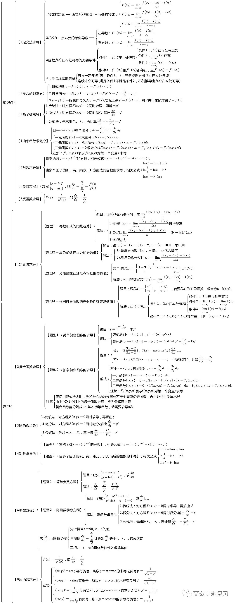

# A、导数

<mark>考试内容：</mark>

```md
- 导数的概念
- 导数的几何意义和物理意义
- 函数的可导性与连续性之间的关系
- 平面曲线的切线和法线
- 导数的四则运算
- 基本初等函数的导数
- 复合函数、反函数、隐函数以及参数方程所确定的函数的微分法
- 高阶导数
- 函数图形的描绘
- 函数的最大值与最小值
```

<mark>考试要求：</mark>

```md
- 理解导数和微分的概念，理解导数与微分的关系，理解导数的几何意义，会求平面曲线的切线方程和法线方程，了解导数的物理意义，会用导数描述一些物理量，理解函数的可导性与连续性之间的关系．
- 掌握导数的四则运算法则和复合函数的求导法则，掌握基本初等函数的导数公式．
- 了解高阶导数的概念，会求简单函数的高阶导数．
- 会求分段函数的导数，会求隐函数和由参数方程所确定的函数以及反函数的导数．
- 理解并会用罗尔（Rolle）定理、拉格朗日（Lagrange）中值定理和泰勒（Taylor）定理，了解并会用柯西(Cauchy）中值定理．
- 掌握用洛必达法则求未定式极限的方法．
- 理解函数的极值概念，掌握用导数判断函数的单调性和求函数极值的方法，掌握函数的最大值和最小值的求法及其应用．
- 会用导数判断函数图形的凹凸性
```

## 1、导数与导函数

设函数 $y=f(x)$ 在点 $x_0$ 的某个领域内有定义，当自变量 $x$ 在 $x_0$ 处取得增量 $\Delta x$（在点 $x_0+\Delta x$ 仍在该领域内）时，相应的函数取得增量 $\Delta y=f(x_0+\Delta x)-f(x_0)$；如果 $\Delta y$ 与 $\Delta x$ 之比当 $\Delta x \to 0$ 的极限存在，则称函数 $y=f(x)$ 在点 $x_0$ 处可导，并称这个极限为函数 $y=f(x)$ 在点 $x_0$ 处的导数，记为 $f'(x)$，即：  
$\Large f'(x)$

- $\Large=\lim\limits_{\Delta x \to 0}\frac{\Delta y}{\Delta x}$

- $\Large=\lim\limits_{\Delta x \to 0}\frac{f(x_0+\Delta x)-f(x_0)}{\Delta x}$

- $\Large=\lim\limits_{h \to 0}\frac{f(x_0+h)-f(x_0)}{h}$

- $\Large=\lim\limits_{x \to x_0}\frac{f(x)-f(x_0)}{x-x_0}$

$f'(x_0)$ 的其他表达形式：

> - $\Large y'\mid_{x=x_0}$
>
> - $\Large \frac{\mathrm{d}y}{\mathrm{d}x}\Bigg |_{x=x_0}$
>
> - $\Large \frac{\mathrm{d}f(x)}{\mathrm{d}x}\Bigg|_{x=x_0}$

- **左导数**：$\Large f_-^{'}(x_0)=\lim\limits_{h \to 0^-}\LARGE \frac{f(x_0+h)-f(x_0)}{h}$

- **右导数**：$\Large f_+^{'}(x_0)=\lim\limits_{h \to 0^+}\LARGE \frac{f(x_0+h)-f(x_0)}{h}$

> $f(x)$ 在 $x_0$ 处可导 $\Longleftrightarrow$ 左右导数存在，且相等

- **导数的意义**

> - 它可以表达曲线的切线的斜率  
> - 它也表达的是某些物理量的瞬时值
> - 导数其实所表达的就是是函数在某点的的变化率

## 2、可导与连续性的关系

$f(x)$ 在 $x_0$ 处可导 $\Longrightarrow$ $f(x)$ 在 $x_0$ 处连续
> 可导必连续，连续不一定可导

## 3、函数的求导

> 若两个函数都在 $x$ 处可导，则它们的和差积商都在 $x$ 处可导

- $\Large [f \pm g]'=f' \pm g'$

- $\Large [f \centerdot g]'=f' \centerdot g+f \centerdot g'$

- $\Large [\frac{f}{g}]'=\frac{f' \centerdot g-f \centerdot g'}{g^2}(g \ne 0)$

### 反函数求导

若函数 $x=f(y)$ 在区间 $I_y$ 内单调、可导且 $f'(y) \ne 0$，则它的反函数 $y=f^{-1}(x)$ 在区间 $I_x=\{x\mid x=f(y),y\in I_y\}$ 内也可导，且：
> $$\Large [f^{-1}(x)]'=\frac{1}{f'(y)}$$
> 也就是说 $\Large f' \centerdot (f^{-1})' = 1$

### 复合函数求导

如果 $u=g(x)$ 在点 $x$ 可导，而 $y=f(u)$ 在点 $u=g(x)$ 可导，则复合函数 $y=f[g(x)]$ 在点 $x$ 可导：

> $$\frac{\mathrm{d}y}{\mathrm{d}x}=\frac{\mathrm{d}y}{\mathrm{d}u}\centerdot\frac{\mathrm{d}u}{\mathrm{d}x}\;或\;y'(x)=f'(u)\centerdot g'(x)$$

### 高阶导数

> 若两个函数都在 $x$ 处有 $n$ 阶导，则它们的和差积商都在 $x$ 处 $n$ 阶导

- $\Large (f\pm g)^{(n)}=f^{(n)}\pm g^{(n)}$

- $(f\centerdot g)^{(n)}=\LARGE \sum_{\mathclap{k=0}}^n C_n^k \;\normalsize f^{(n-k)}g^{(k)}$

### 隐函数求导

有些隐函数不太好显化，所以直接求导

例 $e^y+xy-e=0$：

> 1. 两边同时求导：  
>
>    - $\Large\frac{\mathrm{d}}{\mathrm{d}x}(e^y+xy-e)=\Large\frac{\mathrm{d}(0)}{\mathrm{d}x}$
>
>    - $\Large e^y\frac{\mathrm{d}y}{\mathrm{d}x}+y+x\frac{\mathrm{d}y}{\mathrm{d}x}=0$
>
> 2. 解出 $\Large\frac{\mathrm{d}y}{\mathrm{d}x}$：
>
>    - $\Large\frac{\mathrm{d}y}{\mathrm{d}x}=-\frac{y}{x+e^y},\;(x+e^y\neq0)$

例 $y^5+2y-x-3x^7=0$：

> 1. 两边同时求导得：
>
>    - $\Large5y^4\frac{\mathrm{d}y}{\mathrm{d}x}+2\frac{\mathrm{d}y}{\mathrm{d}x}-1-21x^6=0$
>
> 2. 解出 $\Large\frac{\mathrm{d}y}{\mathrm{d}x}$：
>
>    - $\Large\frac{\mathrm{d}y}{\mathrm{d}x}=\frac{1+21x^6}{5y^4+2}$

**对数求导**，例 $\Large y=x^{\sin x},\;(x>0)$

> 1. 两边取对数：
>
>    - $\ln y=\sin x\ln x$
>
> 2. 两边同时求导：
>
>    - $\Large\frac{1}{y}y'=\cos x \ln x+\frac{\sin x}{x}$
>
> 3. 解出 $y'$：
>
>    - $\Large y'=y(\cos x \ln x+\frac{\sin x}{x})=x^{\sin x}(\cos x \ln x+\frac{\sin x}{x})$

### 参数方程求导

若参数方程：  

> $$\begin{cases}
   x=\varphi(t)\\
   y=\psi(t)
\end{cases}$$

确定 $x$ 与 $y$ 之间的关系，那么：

> $$\Large y'=\frac{\mathrm{d}y}{\mathrm{d}x}=\frac{\psi'(t)}{\varphi'(t)}$$

### 常见求导公式

- 详见[常用公式集]()

## 4、导数的应用

### 罗尔中值定理求极限

#### 费马引理

> 设函数 $f(x)$ 在点 $x_0$ 的某邻域 $U(x_0)$ 内有定义，并且在 $x_0$ 处可导，如果对任意的 $x\in U(x_0)$，有 $f(x)\leqslant f(x_0)$ 或 $f(x) \geqslant f(x_0)$，那么 $f'(x_0)=0$

导数等于零的称为函数的驻点或稳定点、临界点

#### 罗尔定理

> 如果函数 $f(x)$ 满足：
>
> - 在 $[a,\;b]$ 上连续
> - 在 $(a,\;b)$ 内可导
> - $f(a)=f(b)$
>
> 那么在 $(a,\;b)$ 内至少有一点 $\xi$（a<$\xi<b$），使得 $f(\xi)=0$

### 拉格朗日中值定理求极限

> 如果函数 $f(x)$ 满足：
>
> - 在 $[a,\;b]$ 上连续
> - 在 $(a,\;b)$ 内可导
> - $f(a)=f(b)$
>
> 那么在 $(a,\;b)$ 内至少有一点 $\xi$（a<$\xi<b$），使得 $f(b)-f(a)=f'(\xi)(b-a)$
>
> 如果函数在某区间上的导数恒为零，那么函数在这个区间上是一个常数。

### 泰勒中值定理求极限

> 泰勒中值定理是拉格朗日中值定理的推广
>
> 如果函数 $f(x)$ 在含有 $x_0$ 的某个开区间 $(a,\;b)$ 内具有直到 $(n+1)$ 阶的导数，则对任意 $x\in(a,\;b)$，有：
>
>$\LARGE f(x)=f(x_0)+f'(x_0)(x-x_0)+\frac{f''(x_0)}{2!}(x-x_0)^2+...+\frac{f^{(n)}(x_0)}{n!}(x-x_0)^n+R_n(x)$
>
> 其中 $\LARGE R_n(x)=\frac{f^{(n+1)}(\xi)}{(n+1)!}(x-x_0)^{n+1}$，$\xi$ 介于 $x$ 和 $x_0$ 之间

### 柯西中值定理求极限

> 如果函数 $f(x)$，$F(x)$ 满足：
>
> - 在 $[a,\;b]$ 上连续
> - 在 $(a,\;b)$ 内可导
> - 对任意 $x\in(a,\;b)$，$F'(x) \neq 0$
>
> 那么在 $(a,\;b)$ 内至少有一点 $\xi$（a<$\xi<b$），使得 $\LARGE\frac{f(b)-f(a)}{F(b)-F(a)}=\frac{f'(\xi)}{F'(\xi)}$

### 洛必达法则求极限

设：

> - 当 $x\to a$ 时，函数 $f(x)$ 及 $F(x)$ 都趋于零
> - 在点 $a$ 的去心邻域内，$f'(x)$ 及 $F'(x)$ 都存在，且 $F'(x)\neq0$
> - $\LARGE\lim\limits_{x \to a}\frac{f'(x)}{F'(x)}$ 存在或无穷大
>
> 那么，$\LARGE\lim\limits_{x \to a}\frac{f(x)}{F(x)} =\LARGE\lim\limits_{x \to a}\frac{f'(x)}{F'(x)}$

设：

> - 当 $x \to \infty$ 时，函数 $f(x)$ 及 $F(x)$ 都趋于零
> - 当 $\mid x \mid > N$ 时， $f'(x)$ 与 $F'(x)$ 都存在，且 $F'(x)\neq 0$
> - $\LARGE\lim\limits_{x \to \infty}\frac{f'(x)}{F'(x)}$ 存在或无穷大
>
> 那么，$\LARGE\lim\limits_{x \to \infty}\frac{f(x)}{F(x)} =\LARGE\lim\limits_{x \to \infty}\frac{f'(x)}{F'(x)}$

### 判断单调性

若函数在 $[a,b]$ 上连续，在 $(a,b)$ 上可导：

> - 若 $(a,b)$ 内 $f'(x) > 0$，则 $[a,b]$ 内单增
>
> - 若 $(a,b)$ 内 $f'(x) < 0$，则 $[a,b]$ 内单减

### 判断凹凸性和拐点

若函数在某区间内连续：

> - $\LARGE f(\frac{x_1+x_2}{2})<\frac{f(x_1)+f(x_2)}{2} \Longrightarrow$ 区间内**凹**
>
> - $\LARGE f(\frac{x_1+x_2}{2})>\frac{f(x_1)+f(x_2)}{2} \Longrightarrow$ 区间内**凸**

因此，若函数在 $[a,b]$ 连续，在 $(a,b)$ 内一阶导二阶导：

> - 则在 $(a,b)$ 内 $f''(x) > 0 \Longrightarrow [a,b]$ 内**凹**
>
> - 则在 $(a,b)$ 内 $f''(x) < 0 \Longrightarrow [a,b]$ 内**凸**

__拐点__：曲线的凹凸性改变的地方

__求区间内的拐点__：

> 1. 求区间上的 $f''(x)$
> 2. 令 $f''(x)=0$，解出在区间内的实根，并求出在区间内 $f''(x)$ 不存在的点
> 3. 一一对求出的根和不存在的点进行检查，看 $f''(x)$ 在该点左右两侧的符号
> 4. 若符号相反，则是拐点，若相同，则不是拐点

### 求极值、最值

若函数在 $x_0$ 处可导，且在 $x_0$ 取得极值 $\Large\Longrightarrow f'(x_0) = 0$
> 极值点必定是驻点，但驻点不一定是极值点

方法一：

> 若函数在 $x_0$ 处连续，且在 $x_0$ 的某去心邻域内可导：
>
> - 在左半邻域内 $f'(x) > 0$，右半邻域内 $f'(x)<0$，则函数在 $x_0$ 处取得**极大值**
> - 在左半邻域内 $f'(x) < 0$，右半邻域内 $f'(x)>0$，则函数在 $x_0$ 处取得**极小值**
> - 在整个邻域内符号保持不变，则在 $x_0$ 处无极值

方法二：

> 若函数在 $x_0$ 处二阶导，且 $f'(x_0)=0,\;f''(x_0)\neq0$，那么：
>
> - $f''(x_0) < 0 \Longrightarrow$ 函数在 $x_0$ 处取得**极大值**
> - $f''(x_0) > 0 \Longrightarrow$ 函数在 $x_0$ 处取得**极小值**

### 曲线的切线、法线

曲线 $y=f(x)$ 在点 $M(x_0, \;y_0)$ 处的：

- **切线方程**：$y-y_0=f'(x_0)(x-x_0)$

- **法线方程**：$y-y_0=-\Large\frac{1}{f'(x_0)}(x-x_0)$

## 5、网上找的

